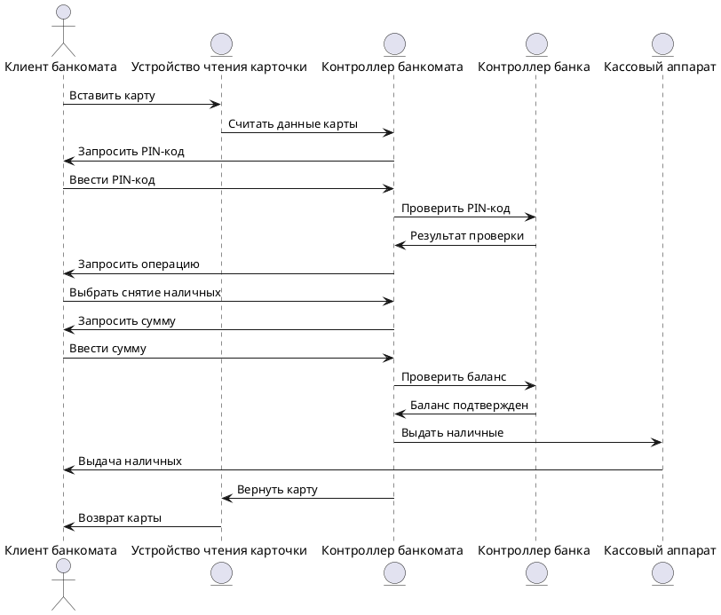

### Прецедент: Внесение средств в банкомат (DepositCash) 
**Описание:** Клиент банкомата (Client) инициирует процесс внесения наличных средств на свой счёт через банкомат. Этот процесс включает следующие шаги: 
1. Клиент вставляет карту в устройство чтения карты банкомата. 
2. Банкомат считывает данные карты и возвращает её номер. 
3. Клиент вводит свой PIN-код, который передается в систему для проверки. 
4. Банкомат запрашивает результат проверки PIN-кода. 
5. После успешной проверки клиент выбирает операцию «Внесение наличных». 
6. Клиент вводит сумму наличных средств, которые он хочет внести. 
7. Банкомат проверяет, есть ли достаточно средств для внесения, и подтверждает операцию. 
8. Если операция подтверждена, кассовый аппарат принимает наличные и зачисляет средства на счёт клиента. 
9. Клиент завершает обслуживание, и карта возвращается. 

**Актёры:** 
- **Клиент банкомата (Client):** Инициирует процесс выполнения банковской операции, вводит PIN-код, выбирает операцию и завершает обслуживание. 
- **Устройство чтения карты (Card Reader):** Считывает карту и передает информацию о ней в систему. 
- **Контроллер банкомата (ATM Controller):** Управляет процессом взаимодействия с клиентом. 
- **Терминал (Terminal):** Обрабатывает запросы и передает их в контроллер банка. 
- **Контроллер банка (Bank Controller):** Проверяет PIN, баланс и одобряет операции. 
- **Кассовый аппарат (Cash Dispenser):** Принимает наличные средства и зачисляет их на счёт клиента. 

**Предусловия:** 
- Клиент имеет активную банковскую карту и знает свой PIN-код.
- Система банкомата подключена к банковской сети и работает корректно.

**Постусловия:** 
- Внесенные средства зачислены на счёт клиента. 
- Карта клиента возвращена. 

**Основной успешный сценарий:** 
1. Клиент вставляет карту. 
2. Система считывает карту и возвращает номер карты. 
3. Клиент вводит PIN-код. 
4. Система проверяет PIN-код. 
5. Клиент выбирает операцию «Внесение наличных». 
6. Клиент вводит сумму наличных. 
7. Система проверяет доступность средств для внесения. 
8. Операция подтверждается, и средства зачисляются на счёт. 
9. Карта возвращается клиенту. 

**Диаграмма последовательности (Sequence Diagram):**

