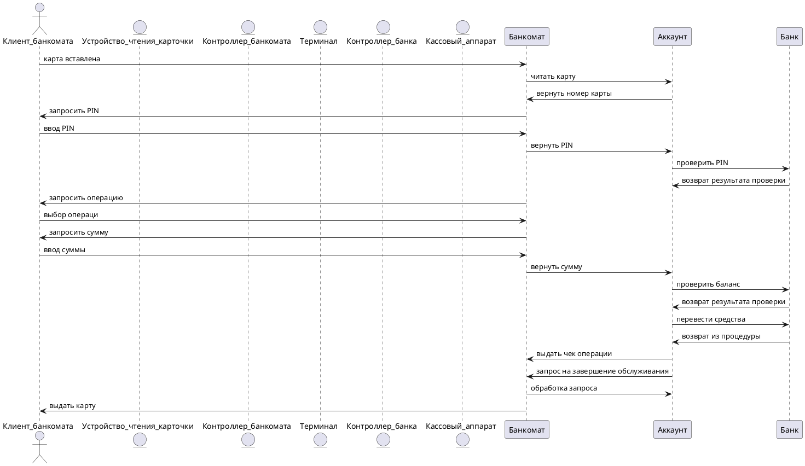

# Прецедент: **Перевод средств** (ATM Usage)

## Описание:

Клиент банкомата инициирует процесс выполнения банковской операции, такой как снятие наличных или просмотр баланса. Процесс включает в себя следующие шаги:

- Клиент вставляет карту в устройство чтения карточки.
- Банкомат считывает данные карты и запрашивает ввод PIN-кода.
- После проверки PIN-кода клиент выбирает необходимую операцию.
- Клиент вводит сумму (если это необходимо для операции).
- Банк проверяет баланс и, при необходимости, выполняет перевод средств.
- После завершения операции клиент может запросить чек или завершить обслуживание.
- Банкомат возвращает карту клиенту.

Этот процесс обеспечивает безопасное выполнение операций с использованием банкомата.

## Актёры:

- **Клиент банкомата** (ATM Client): Инициирует процесс выполнения банковской операции, вводит PIN-код, выбирает операцию и завершает обслуживание.
- **Банкомата** (ATM): Координирует взаимодействие между клиентом, терминалом и банковской системой.
- **Банк** (Bank): Проверяет данные клиента, обрабатывает операции и управляет балансом.
- **Аккаунт** (Client): Иницирует выдачу чека или наличные средства по запросу клиента.

## Предусловия:
- Клиент имеет активную банковскую карту и знает свой PIN-код.
- Банкомат подключен к банковской сети и работает корректно.
- На счету клиента достаточно средств.

## Постусловия:

- Банковская операция завершена (например, средства сняты или баланс отображен).
- Карта клиента возвращена.

---

## Основной успешный сценарий:

1. **Клиент банкомата** вставляет карту в устройство чтения карточки.
2. **Банкомат** считывает карту и передает данные **Контроллеру банкомата**.
3. **Клиент банкомата** вводит PIN-код.
4. **Банкомат** запрашивает проверку PIN-кода.
5. **Банк** подтверждает корректность PIN-кода.
6. **Клиент банкомата** выбирает операцию.
7. **Банкомат** запрашивает детали операции через **Аккаунт**.
8. **Клиент банкомата** вводит сумму (если необходимо).
9. **Аккаунт** проверяет баланс через **Банк**.
10. **Банк** подтверждает наличие средств и выполняет перевод.
11. **Аккаунт** отправляет запрос на чек через **Банкомат** (если запрошено).
12. **Аккаунт** завершает обслуживание, и **Банкомат** возвращает карту.

---

## Диаграмма последовательности (Sequence Diagram):

