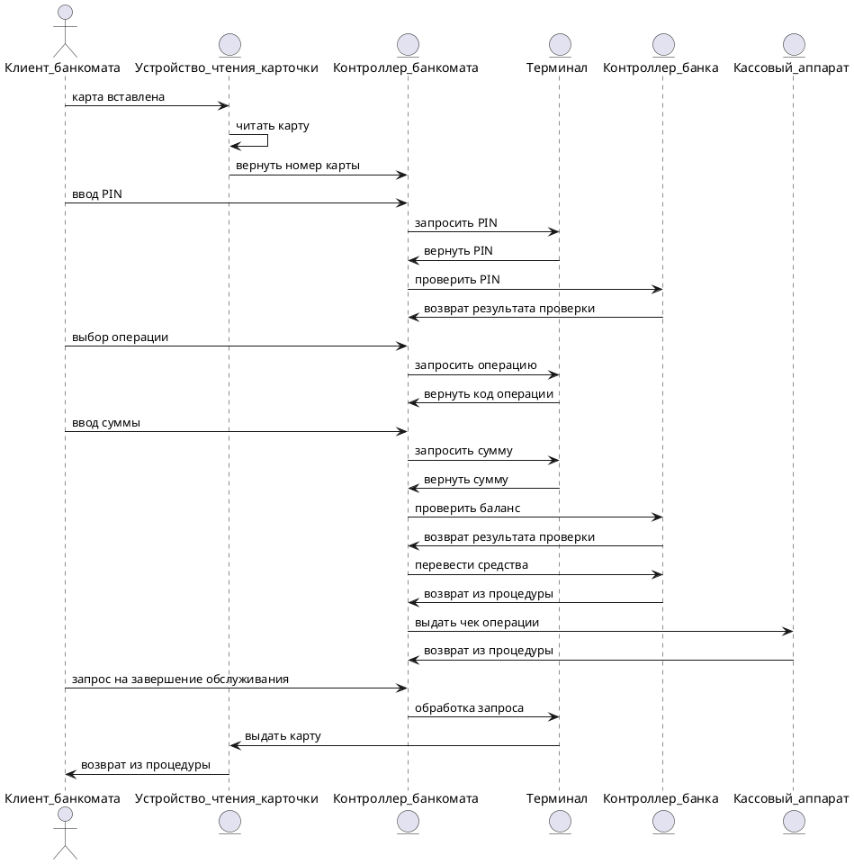

# Прецедент: **Перевод средств** (ATM Usage)

## Описание:

Клиент банкомата инициирует процесс выполнения банковской операции, такой как снятие наличных или просмотр баланса. Процесс включает в себя следующие шаги:

- Клиент вставляет карту в устройство чтения карточки.
- Система считывает данные карты и запрашивает ввод PIN-кода.
- После проверки PIN-кода клиент выбирает необходимую операцию.
- Клиент вводит сумму (если это необходимо для операции).
- Система проверяет баланс и, при необходимости, выполняет перевод средств.
- После завершения операции клиент может запросить чек или завершить обслуживание.
- Система возвращает карту клиенту.

Этот процесс обеспечивает безопасное выполнение операций с использованием банкомата.

## Актёры:

- **Клиент банкомата** (ATM Client): Инициирует процесс выполнения банковской операции, вводит PIN-код, выбирает операцию и завершает обслуживание.
- **Устройство чтения карточки** (Card Reader): Считывает данные с карты клиента и возвращает карту после завершения операции.
- **Контроллер банкомата** (ATM Controller): Координирует взаимодействие между клиентом, терминалом и банковской системой.
- **Терминал** (Terminal): Обрабатывает запросы и передает информацию между клиентом и системой.
- **Контроллер банка** (Bank Controller): Проверяет данные клиента, обрабатывает операции и управляет балансом.
- **Кассовый аппарат** (Cash Dispenser): Выдает чек или наличные средства по запросу клиента.

## Предусловия:

- Клиент имеет активную банковскую карту и знает свой PIN-код.
- Система банкомата подключена к банковской сети и работает корректно.

## Постусловия:

- Банковская операция завершена (например, средства сняты или баланс отображен).
- Карта клиента возвращена.

---

## Основной успешный сценарий:

1. **Клиент банкомата** вставляет карту в устройство чтения карточки.
2. **Устройство чтения карточки** считывает карту и передает данные **Контроллеру банкомата**.
3. **Клиент банкомата** вводит PIN-код.
4. **Контроллер банкомата** запрашивает проверку PIN-кода через **Терминал**.
5. **Контроллер банка** подтверждает корректность PIN-кода.
6. **Клиент банкомата** выбирает операцию.
7. **Контроллер банкомата** запрашивает детали операции через **Терминал**.
8. **Клиент банкомата** вводит сумму (если необходимо).
9. **Контроллер банкомата** проверяет баланс через **Контроллер банка**.
10. **Контроллер банка** подтверждает наличие средств и выполняет перевод.
11. **Контроллер банкомата** отправляет запрос на чек через **Кассовый аппарат** (если запрошено).
12. **Клиент банкомата** завершает обслуживание, и **Устройство чтения карточки** возвращает карту.

---

## Диаграмма последовательности (Sequence Diagram):

