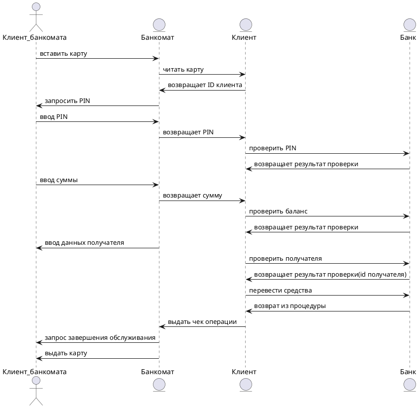

# Прецедент: **Перевод средств** (ATM Money Transfer)

## Описание:

Клиент банкомата инициирует процесс перевода средств на другой счет. Процесс включает следующие шаги:

1. Клиент вставляет карту в банкомат.
2. Банкомат считывает данные карты и запрашивает у клиента ввод PIN-кода.
3. После ввода PIN-кода банкомат передает его на проверку в банковскую систему.
4. При успешной проверке клиент вводит сумму перевода и данные получателя.
5. Банк проверяет баланс клиента и корректность данных получателя.
6. Если все условия выполнены, банк выполняет перевод средств на указанный счет.
7. По завершении операции банкомат может выдать чек по запросу клиента.
8. Банкомат возвращает карту клиенту.

Этот процесс обеспечивает безопасный перевод средств через банкомат.

## Актёры:

- **Клиент банкомата**: Инициирует операцию перевода, вводит PIN-код, сумму и данные получателя.
- **Банкомат**: Управляет взаимодействием клиента с банковской системой.
- **Банк**: Проверяет корректность данных, баланс и выполняет перевод средств.
- **Аккаунт** (Client): Иницирует выдачу чека или наличные средства по запросу клиента.

## Предусловия:

- Клиент имеет действующую банковскую карту с известным PIN-кодом.
- На счете клиента достаточно средств для перевода.
- Банкомат подключен к банковской сети.

## Постусловия:

- Средства успешно переведены на счет получателя.
- Карта клиента возвращена.

---

## Основной успешный сценарий:

1. **Клиент банкомата** вставляет карту в банкомат.
2. **Банкомат** считывает карту и передает данные в **банк**.
3. **Банкомат** запрашивает у клиента ввод PIN-кода.
4. **Клиент банкомата** вводит PIN-код.
5. **Банкомат** передает PIN-код для проверки в **банк**.
6. **Банк** подтверждает корректность PIN-кода.
7. **Клиент банкомата** вводит сумму перевода и данные получателя.
8. **Банкомат** передает запрос на проверку баланса и данных получателя в **банк**.
9. **Банк** проверяет баланс клиента и данные получателя.
10. **Банк** выполняет перевод средств при успешной проверке.
11. **Банкомат** выдает чек (по запросу).
12. **Клиент банкомата** завершает обслуживание, и **банкомат** возвращает карту.

---

## Диаграмма последовательности:

