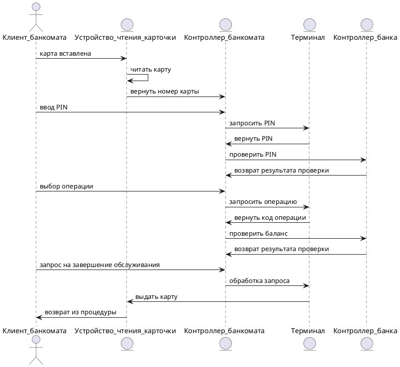

# Прецедент: **Проверка баланса** (ATM Operations)

## Описание:

Клиент банкомата инициирует процесс выполнения банковских операций, таких как проверка баланса или завершение обслуживания. Процесс включает следующие шаги:

- Клиент вставляет карту в устройство чтения карточки.
- Система считывает карту и возвращает номер карты.
- Клиент вводит PIN-код для подтверждения своей личности.
- После проверки PIN-кода клиент выбирает операцию.
- Система проверяет баланс клиента для выбранной операции.
- По завершении клиент может запросить возврат карты и завершить обслуживание.

Этот процесс позволяет клиенту безопасно и удобно выполнять банковские операции.

## Актёры:

- **Клиент банкомата** (ATM Client): Инициирует процесс выполнения банковской операции, вводит PIN-код, выбирает операцию и завершает обслуживание.
- **Устройство чтения карточки** (Card Reader): Считывает данные карты и возвращает её после завершения обслуживания.
- **Контроллер банкомата** (ATM Controller): Координирует обработку запросов клиента.
- **Терминал** (Terminal): Передаёт запросы от контроллера банкомата к банковской системе и возвращает результаты.
- **Контроллер банка** (Bank Controller): Проверяет корректность введённого PIN-кода и состояние счёта клиента.

## Предусловия:

- Клиент имеет активную банковскую карту и знает свой PIN-код.
- Система банкомата подключена к банковской сети и работает корректно.
- 
## Постусловия:

- Выбранная клиентом операция успешно выполнена.
- Карта клиента возвращена.

---

## Основной успешный сценарий:

1. **Клиент банкомата** вставляет карту в устройство чтения карточки.
2. **Устройство чтения карточки** считывает карту и возвращает номер карты.
3. **Клиент банкомата** вводит PIN-код.
4. **Контроллер банкомата** запрашивает PIN-код через **Терминал**, который проверяет его у **Контроллера банка**.
5. **Контроллер банка** возвращает результат проверки PIN-кода.
6. **Клиент банкомата** выбирает операцию.
7. **Контроллер банкомата** отправляет запрос на проверку баланса через **Терминал**.
8. **Контроллер банка** возвращает результат проверки баланса.
9. **Клиент банкомата** завершает обслуживание.
10. **Терминал** отправляет запрос на возврат карты.
11. **Устройство чтения карточки** возвращает карту клиенту.

---

## Диаграмма последовательности (Sequence Diagram):

