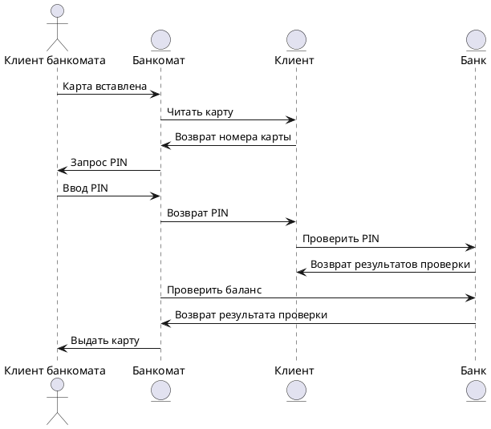

# Прецедент: Проверка баланса

## Описание:  
Клиент банкомата (Client) инициирует процесс, включающий ввод PIN-кода и проверку баланса. Этот процесс выполняется через взаимодействие с банкоматом и банковской системой.  

1. Клиент вставляет карту в банкомат.  
2. Банкомат считывает данные карты и передаёт её номер.  
3. Клиент вводит PIN-код.  
4. Банкомат передаёт PIN-код в банк для проверки.  
5. Банк проверяет корректность PIN-кода и возвращает результат.  
6. Банк проверяет баланс клиента по запросу банкомата.  
7. Банкомат завершает обслуживание клиента.  
8. Карта клиента возвращается из банкомата.  

## Актёры:  
- **Клиент банкомата (Client):** Инициирует процесс, вводит PIN-код.  
- **Банкомат (ATM):** Обеспечивает ввод карты, передачу данных, завершение операции.  
- **Банк (Bank):** Проверяет PIN-код и предоставляет данные о балансе.  
- **Аккаунт** (Client): Иницирует выдачу чека или наличные средства по запросу клиента.

## Предусловия:  
- Клиент имеет активную банковскую карту и знает свой PIN-код.  
- Банкомат подключён к банковской системе.  

## Постусловия:  
- Клиент успешно завершает процесс проверки баланса.  
- Карта возвращена клиенту.  

## Основной успешный сценарий:  

1. Клиент вставляет карту в банкомат.  
2. Банкомат считывает номер карты.  
3. Клиент вводит PIN-код.  
4. Банкомат передаёт PIN-код в банк.  
5. Банк проверяет PIN-код и возвращает результат проверки.  
6. Банкомат запрашивает проверку баланса.  
7. Банк предоставляет информацию о балансе.  
8. Клиент завершает процесс, и банкомат возвращает карту.  

## Диаграмма последовательности (Sequence Diagram):  

