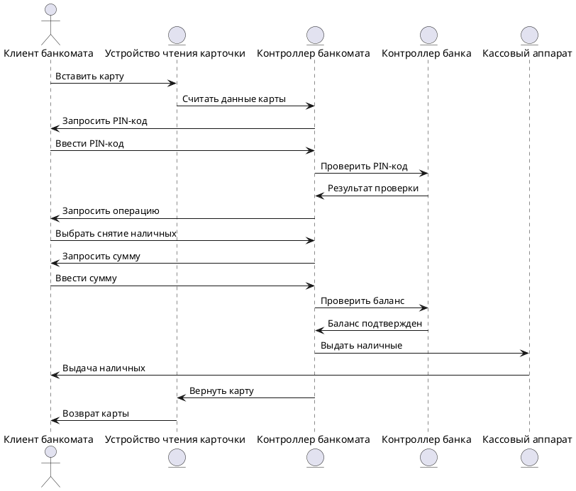

### **Прецедент: Снятие наличных (Withdraw Cash)** 
#### **Описание** Клиент банкомата инициирует процесс снятия наличных. Процесс включает следующие шаги: 
1. Клиент вставляет карту в банкомат. 
2. Система считывает данные карты и запрашивает PIN-код. 
3. Клиент вводит PIN-код, а система проверяет его корректность. 
4. После успешной проверки PIN-кода клиент выбирает операцию «Снятие наличных». 
5. Клиент вводит сумму, которую хочет снять. 
6. Система проверяет баланс на счету клиента. 
7. Если баланс достаточен, система подтверждает операцию, снимает средства и выдает наличные. 
8. Карта возвращается клиенту, и система завершает сеанс. Этот процесс позволяет клиенту получить наличные со своего банковского счета через банкомат. 
#### **Актёры** 
1. **Клиент банкомата (ATM Client):** Инициирует процесс выполнения банковской операции, вводит PIN-код, выбирает операцию и завершает обслуживание.
3. **Устройство чтения карточки (Card Reader):** Считывает карту и передает данные. 
4. **Контроллер банкомата (ATM Controller):** Обрабатывает запросы, проверяет PIN и выполняет операции. 
5. **Контроллер банка (Bank Controller):** Проверяет баланс клиента и одобряет транзакции. 
6. **Кассовый аппарат (Cash Dispenser):** Выдает наличные клиенту.
#### **Предусловия** 
- Клиент имеет активную банковскую карту и знает свой PIN-код.
- Система банкомата подключена к банковской сети и работает корректно.
- На счету клиента достаточно средств.
#### **Постусловия** 
1. Средства успешно сняты со счета клиента. 
2. Клиент получил наличные. 
3. Сеанс завершен, карта возвращена.
### **Основной успешный сценарий** 
1. Клиент вставляет карту в устройство чтения. 
2. Устройство чтения карты считывает данные и передает их в систему. 
3. Система запрашивает ввод PIN-кода. 
4. Клиент вводит PIN-код, система проверяет его корректность. 
5. Клиент выбирает операцию «Снятие наличных» и вводит сумму. 
6. Система проверяет баланс клиента и подтверждает транзакцию. 
7. Система инициирует выдачу наличных через кассовый аппарат. 
8. Клиент получает карту обратно, и сеанс завершается.
### **Диаграмма последовательности (Sequence Diagram)**

