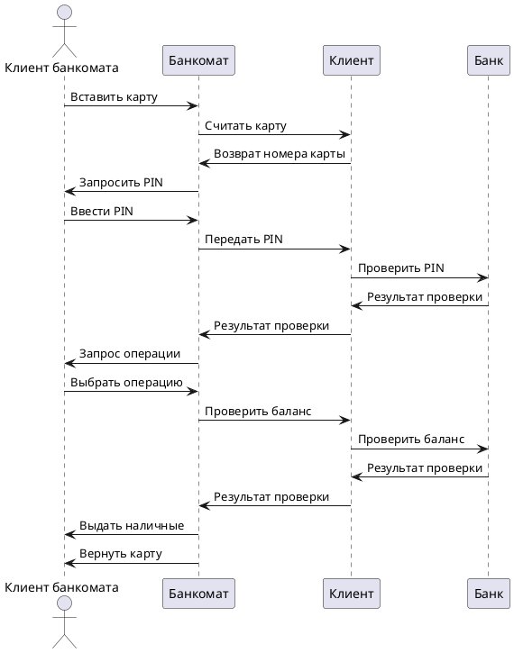

# Прецедент: **Снятие наличных средств в банкомате** (WithdrawCash)

## Описание: 

Клиент банкомата (Client ATM) инициирует процесс снятия наличных средств со своего счёта. Процесс включает следующие шаги:

1. Клиент вставляет карту в банкомат.
2. Банкомат считывает данные карты и передаёт номер карты клиентской системе.
3. Клиент вводит PIN-код, который передаётся в банковскую систему для проверки.
4. Банк проверяет PIN-код и возвращает результат проверки.
5. Клиент выбирает операцию «Снятие наличных».
6. Клиент указывает сумму для снятия.
7. Банк проверяет баланс на счёте клиента.
8. При успешной проверке наличные выдаются клиенту.
9. Клиент завершает обслуживание, и карта возвращается.

## Актёры:

- **Клиент банкомата (Client ATM):** Инициирует процесс, вводит PIN-код, выбирает операцию и сумму.
- **Банкомат (ATM):** Управляет процессом взаимодействия с клиентом.
- **Банк (Bank):** Проверяет PIN-код, баланс и одобряет операции.
- **Аккаунт** (Client): Иницирует выдачу чека или наличные средства по запросу клиента.

## Предусловия:

- У клиента есть активная банковская карта с достаточным балансом.
- Банкомат подключен к банковской системе и работает корректно.

## Постусловия:

- Средства списаны с баланса клиента.
- Клиент получил запрошенную сумму наличными.
- Карта клиента возвращена.

## Основной успешный сценарий:

1. Клиент вставляет карту.
2. Банкомат считывает данные карты.
3. Клиент вводит PIN-код.
4. Банк проверяет PIN-код.
5. Клиент выбирает операцию «Снятие наличных».
6. Клиент указывает сумму для снятия.
7. Банк проверяет баланс и подтверждает операцию.
8. Банкомат выдаёт наличные.
9. Карта возвращается клиенту.

## Диаграмма последовательности (Sequence Diagram):

